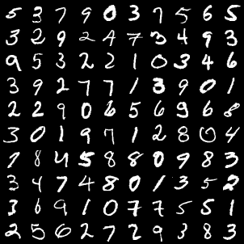
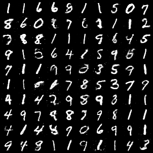
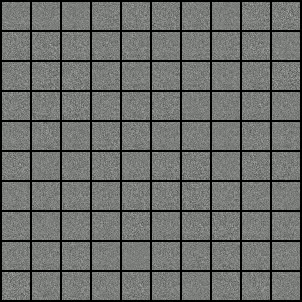

# MNIST_GANs_PyTorch

You can see how our predicts or generates images.

These are the **REAL IMAGES**

These are the **GENERATED IMAGES**

Thats not bad right.

Evolution of the generated images.

